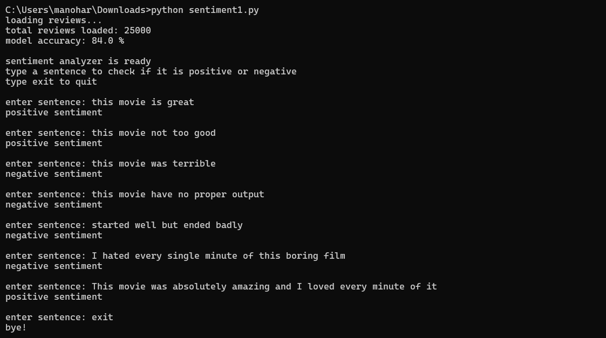

# Sentiment Analysis using NLP

## About
A machine learning model that classifies movie reviews 
as positive or negative using NLP techniques.

## Dataset
IMDb Large Movie Review Dataset (Stanford) - 25,000 reviews

## Tech Stack
- Python
- Scikit-learn
- Pandas
- TF-IDF Vectorizer
- Logistic Regression

## Model Performance
- Accuracy: 84%
- Training samples: 5000
- Dataset size: 25,000 reviews

## How to Run
1. Download the IMDb dataset from:
   https://ai.stanford.edu/~amaas/data/sentiment/
2. Install required libraries:
   pip install scikit-learn pandas
3. Update the train_path in sentiment1.py
4. Run:
   python sentiment1.py

## Output

## What I learned
- Text preprocessing using TF-IDF
- Training a Logistic Regression classifier
- Evaluating ML model accuracy
- Building a real-time prediction system
